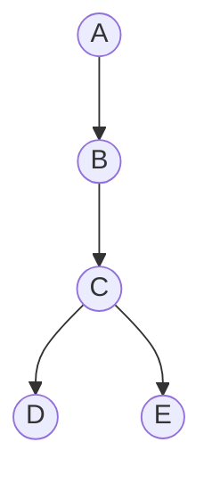

# 回溯

## 示例



以上图为例，我们要遍历所有路径。

1. 首先得出路径 `A->B-C`
2. 面临选择时，先选择 `D` 得出 `A->B->C->D`
3. 然后回撤刚才的选择 `D` 得出 `A->B->C`
4. 再选择 `E` 得出 `A->B->C-E`

回溯的核心就是：在面对选择时，先选择一种（对应步骤 2），然后回撤（对应步骤 3），再选择第二种（对应步骤 4）。

这样就能保证走完所有的可能的前提下，可以基于过去的选择做选择，而不必从头开始。

## 回溯模板

```javascript
function Backtrack(选择列表) {
  const results = [];
  const path = [];

  const isValid = (选择) => {
    // ...logic
    return boolean; // 是否满足
  };

  const recursion = () => {
    if (满足条件) {
      results.push([...path]); // 保存路径
    }

    for (选择 in 选择列表) {
      if (isValid(选择)) {
        // 判断当前选择是否有效（可能不需要判断）
        path.push(选择); // 添加路径 ==> 对应示例步骤2 、 4
        recursion();
        path.pop(); // 撤销路径 ==> 对应示例步骤3
      }
    }
  };

  recursion();
}
```

## 解数独

[leetcode链接](https://leetcode.cn/problems/sudoku-solver/)

```javascript
var solveSudoku = function (board) {
  function isValid(row, col, val) {
    let i = 0;
    // 检查列是否有重复
    while (i < 9) {
      if (board[row][i] === val) return false;
      i++;
    }

    i = 0;
    // 检查行是否有重复
    while (i < 9) {
      if (board[i][col] === val) return false;
      i++;
    }

    let x = Math.floor(col / 3) * 3;
    let y = Math.floor(row / 3) * 3;
    let xMax = x + 3;
    let yMax = y + 3;

    // 检查九宫格是否有重复
    while (x < xMax) {
      let y = Math.floor(row / 3) * 3;
      while (y < yMax) {
        if (board[y][x] === val) {
          return false;
        }
        y++;
      }
      x++;
    }

    return true;
  }

  const recursion = () => {
    let row = 0;
    // 遍历行
    while (row < 9) {
      // 遍历列
      let col = 0;
      while (col < 9) {
        // 判断当前行 每一列是否都已经是数字了
        if (board[row][col] !== ".") {
          col++;
          continue;
        }

        // 当前的格子非数字， 依次尝试放入 1 - 9
        let num = 1;
        while (num <= 9) {
          if (isValid(row, col, num + "")) {
            board[row][col] = num + "";
            // 当找到结果后终止执行
            if (recursion()) {
              return true;
            }
            board[row][col] = ".";
          }
          num++;
        }

        // 执行到此处 表示每一列尝试放入 1 - 9 依然不能保证当前行 都是数字
        // 中断后续的尝试
        return false;
      }
      row++;
    }

    // 此时表示每个 row col 都找到了合适数字
    return true;
  };

  recursion();

  return board;
};
```
