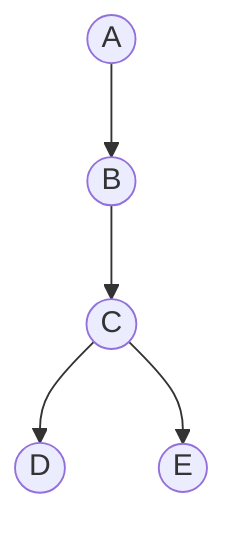

# 回溯

## 示例



以上图为例，我们要遍历所有路径。

1. 首先得出路径 `A->B-C`
2. 面临选择时，先选择 `D` 得出 `A->B->C->D`
3. 然后回撤刚才的选择 `D` 得出 `A->B->C`
4. 再选择 `E` 得出 `A->B->C-E`

回溯的核心就是：在面对选择时，先选择一种（对应步骤2），然后回撤（对应步骤3），再选择第二种（对应步骤4）。

这样就能保证走完所有的可能的前提下，可以基于过去的选择做选择，而不必从头开始。

## 回溯模板

```javascript
function Backtrack(选择列表) {
  const results = [];
  const path = []

  const isValid = (选择) => {
    // ...logic
    return boolean // 是否满足
  }

  const recursion = () => {
    if (满足条件) {
      results.push([...path]); // 保存路径
    }

    for (选择 in 选择列表) {
      if (isValid(选择)) { // 判断当前选择是否有效（可能不需要判断）
        path.push(选择) // 添加路径 ==> 对应示例步骤2 、 4
        recursion();
        path.pop() // 撤销路径 ==> 对应示例步骤3
      }
    }
  };

  recursion();
}
```

## 全排列

```javascript
var permuteUnique = function (nums) {
  
};
```
