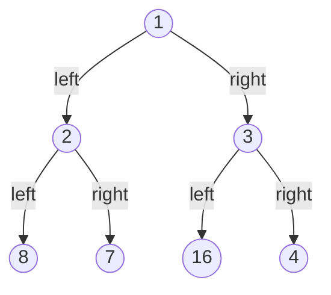

# 小结

## 双指针

双指针法基本用于处理字符串、数组和链表相关问题。

两个指针起始位置可以处在不同的位置，移动的规则也不同。

- 一个指向开头一个指向结尾。可以解决[反转字符串](https://leetcode.cn/problems/reverse-string/)类似的问题。
- 都指向开头，但是移动的速度不同，一个每次前进一步，另一个每次前进两步（**快慢指针**）。

  > 示例

  ```javascript
  let slow = 0;
  let fast = 0;

  while (fast < len) {
    ...

    fast += 2;
    slow++;
  }
  ```

- 都指向开头，一个每次前进一步，另一个按照判断逻辑是否移动指针（**快慢指针**）。

  > 示例

  ```javascript
  let slow = 0;
  let fast = 0;

  while (i < len) {
    if (xxx) {
      ...
      slow++;
    }

    fast++;
  }
  ```

- 一个指向开头，一个指向后面的节点，根据判断逻辑移动指针（**滑动窗口**）。

  > 示例

  ```javascript
  let left = 0;
  let right = 1;

  while (right < length) {
    // 增大窗口
    right++;

    while (xx) {
      // 缩小窗口
      left++;
    }
  }
  ```

## 递归

递归一般处理重复性的问题。

将处理的问题的逻辑封装好，然后进行重复的调用。

> 示例

```javascript
function recursion() {
  // 重复性逻辑
  ...

  // 避免死循环
  if (xxx) {
    recursion();
  }
}
```

## 回溯

回溯是递归的过程中增加一步**回撤**的逻辑。

可以用于处理类似[二叉树所有路径](https://leetcode.cn/problems/binary-tree-paths/)及[排列组合](https://leetcode.cn/problems/combinations/)等问题。

> 示例

```javascript
const paths = []
function recursion() {
  // 重复性逻辑
  ...

  // 避免死循环
  if (xxx) {
    recursion();
  }
  // 回撤逻辑
  ...
}
```

## 贪心

以局部最优推算全局最优。难点在于找出什么是**局部最优**。

同时要考虑后面的局部决策，不会被前面的影响。

可以用于处理类似[分发饼干](https://leetcode.cn/problems/assign-cookies/)等问题。

## 动态规划

动态规划每一步的计算逻辑，依赖于上一步的计算逻辑，即最终的问题，是由 N 多个重叠的子问题构成。

动态规划问题的解题步骤

1. 先建立一个 dp （Dynamic Programming）数组。一般为二维数组，有些问题可以优化空间至一维数组。
2. 建立推导公。即如何根据上一步的状态，计算下一步的状态的逻辑。
3. 初始化 dp 数组。这样才能开始进行初始的推导。
4. 确定循环顺序。
   4.1 有些问题可以优化二维数组为一维数组。就需要从后往前遍历，因为从后往前可以拿到上一次的运算结果，如果从前往后就会覆盖之前的运算结果。
   4.2 如果循环是选择物品，从后往前遍历，可以保证物品被使用一次。如果从前往后，则前面的计算结果可能是已经使用过该商品，后续的计算如果用到了这个计算结果，则该物品就会被多次使用。

可以用于处理类似[打家劫舍](https://leetcode.cn/problems/house-robber/)和[买卖股票的最佳时机](https://leetcode.cn/problems/best-time-to-buy-and-sell-stock/)等问题。

## KMP

最长公共前后缀。前缀不包含最后一个字符，后缀不包含第一个字符。

例如 `aabaa`

| 字符  | 最长公共前后缀 | 最长公共前后缀长度 |
| ----- | -------------- | ------------------ |
| aa    | a              | 1                  |
| aab   | ''             | 0                  |
| aaba  | a              | 1                  |
| aabaa | aa             | 2                  |

可以用于处理类似 [模式串匹配](https://leetcode.cn/problems/find-the-index-of-the-first-occurrence-in-a-string/) 等问题。

> 求字符串最长公共前后缀

```javascript
function getPrefixSuffixMaxResults(str) {
  const results = [0];
  const len = str.length;
  let i = 1;
  let j = 0;

  while (i < len) {
    if (&& j > 0 && str[i] !== str[j]) {
      // results 表示最长公共前后缀个数
      // 如果 str[i] !== str[j]， 则找 第 j - 1 个字符的最长公共前后缀个数 results[j - 1]
      // 因为 results 表示最长公共前后缀个数，所以直接取 results[j - 1] 就是需要再次比较的下标
      // 可得逻辑  j = results[j - 1];
      j = results[j - 1];
      continue;
    }

    if (str[i] === str[j]) {
      j++;
    }

    i++;
    results.push(j);
  }

  return results;
}
```

## 小顶堆

小顶堆的定义

- 一个完全二叉树
- 二叉树上的任意节点值都必须小于等于其左右子节点值（大顶堆是大于等于其左右子节点值）

因为是完全二叉树，使用数组表示小顶堆，这样处理起来更方便。



即 `[1, 2, 3, 8, 7, 16, 4]`

可以用于处理类似 [前 K 个高频元素](https://leetcode.cn/problems/top-k-frequent-elements/) 等问题。

> 小顶堆实现

```javascript
class Heap {
  // 完全二叉树在数组中满足以下特点
  // 某节点下标 i， left 节点下标为 i *  2，right 节点下标为 i *  2 + 1
  heap = [null]; // 初始为 [null] 是为了方便计算

  push(v) {
    const heap = this.heap;

    heap.push(v);

    // 上浮元素
    this.up();
  }

  pop() {
    const heap = this.heap;
    const top = heap[1];

    // 下沉元素
    this.down();

    return top;
  }

  size() {
    return this.heap.length - 1;
  }

  up() {
    const heap = this.heap;
    const len = this.heap.length;

    let idx = len - 1;
    let parentIdx = Math.floor(idx / 2);

    while (parentIdx > 0 && heap[parentIdx] > heap[idx]) {
      this.swap(idx, parentIdx);

      idx = parentIdx;
      parentIdx = Math.floor(idx / 2);
    }
  }

  down() {
    const heap = this.heap;
    heap[1] = heap.pop();
    const len = this.heap.length;

    let parentIdx = 1;
    let leftIdx = parentIdx * 2;
    let rightIdx = leftIdx + 1;
    let swapIdx = this.getDownSwapIdx(leftIdx, rightIdx);

    while (swapIdx < len && heap[swapIdx] && heap[parentIdx] > heap[swapIdx]) {
      this.swap(parentIdx, swapIdx);

      parentIdx = swapIdx;
      leftIdx = swapIdx * 2;
      rightIdx = leftIdx + 1;
      swapIdx = this.getDownSwapIdx(leftIdx, rightIdx);
    }
  }

  getDownSwapIdx(leftIdx, rightIdx) {
    const heap = this.heap;

    // right 节点不存在则尝试取 left 节点
    if (heap[rightIdx] === undefined) return leftIdx;

    return heap[leftIdx] > heap[rightIdx] ? rightIdx : leftIdx; // 让较小的上浮
  }

  swap(a, b) {
    const heap = this.heap;

    [heap[a], heap[b]] = [heap[b], heap[a]];
  }
}
```

## 单调栈

单调栈用于查找数组元素中下一个比它大或小的元素的场景。

以查找数组元素中下一个比它大的元素为例：

栈维护的是未找到比它大的元素的下标，维护下标是为了方便查找元素。

栈的元素顺序是从大到小的顺序，因为在遍历过程中，如果找到了比栈尾大的元素，则让栈中的元素依次出栈。

可以用于处理类似 [每日温度](https://leetcode.cn/problems/daily-temperatures/) 等问题。

> 求数组元素中下一个比它大的元素

```javascript
function monotonicStack(array) {
  const len = array.length;
  const results = Array(len).fill(0);
  const stack = [0]; // 单调栈
  let i = 1;

  while (i < len) {
    // 遍历过程中的元素如果大于栈尾的元素，则让栈中的元素依次出栈
    while (stack.length !== 0 && array[stack[stack.length - 1]] < array[i]) {
      const v = stack.pop();
      results[v] = i - v;
    }

    // 将当前元素推入到栈中
    stack.push(i);
    i++;
  }

  return results;
}
```
