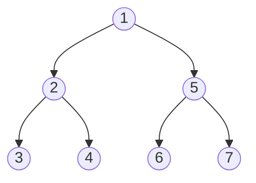

# 二叉树

## 示例



## 遍历

### 前序遍历

中->左->右

#### 递归

```javascript
const preOrder = (tree) => {
  const results = [];

  function recursion(tree, results) {
    results.push(tree.val);
    if (tree.left) recursion(tree.left, results);
    if (tree.right) recursion(tree.right, results);
  }

  recursion(tree, results);
  return results;
};
```

#### 栈

```javascript
const preOrder = (tree) => {
  const stock = [tree];
  const results = [];

  while (stock.length) {
    const node = stock.pop();
    results.push(node.val);
    node.left && stock.push(node.left);
    node.right && stock.push(node.right);
  }

  return results;
};
```

### 中序遍历

左->中->右

#### 递归

```javascript
const inOrder = (tree) => {
  const results = [];

  function recursion(tree, results) {
    if (tree.left) recursion(tree.left, results);
    results.push(tree.val);
    if (tree.right) recursion(tree.right, results);
  }

  recursion(tree, results);
  return results;
};
```

#### 栈

```javascript
function inOrder(tree) {
  const stock = [];
  const results = [];
  let cur = tree;

  while (stock.length || cur) {
    if (cur) {
      stock.push(cur);
      cur = cur.left;
    } else {
      const node = stock.pop();
      results.push(node.val);
      cur = node.right;
    }
  }

  return results;
}
```

### 后序遍历

左->右->中

#### 递归

```javascript
const postOrder = (tree) => {
  const results = [];

  function recursion(tree, results) {
    if (tree.left) recursion(tree.left, results);
    if (tree.right) recursion(tree.right, results);
    results.push(tree.val);
  }

  recursion(tree, results);
  return results;
};
```

#### 栈

```javascript
function postOrder(tree) {
  const stock = [];
  const results = [];

  let pre;
  let cur = tree;

  while (stock.length) {
    cur = stork[stock.length - 1];

    if (cur.left && cur.left !== pre && cur.right !== pre) {
      stock.push(cur.left);
    } else if (cur.right && cur.right !== pre) {
      stock.push(cur.right);
    } else {
      results.push(stock.pop().val);
      pre = cur;
    }
  }

  return results;
}
```

### 层级遍历

```javascript
function breadthTraversal(tree) {
  const results = []
  if (tree) {
    let stock = [];
    let tmp = [tree];

    while (tmp.length !== 0) {
      stock = tmp;
      tmp = [];

      let i = 0;
      const len = stock.length;

      while (i < len) {
        const node = stock[i];
        if (node.left) tmp.push(node.left);
        if (node.right) tmp.push(node.right);
        results.push(node.val);
        i++;
      }
    }
  }

  return results
}
```