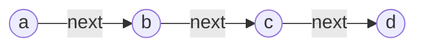
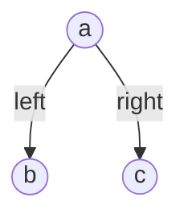

# 小结

## 字符串

> 示例

```javascript
const string = "abcd";
```

[**String**]((https://developer.mozilla.org/zh-CN/docs/Web/JavaScript/Reference/Global_Objects/String) 对象用于表示和操作字符序列。

字符串是一串连续的字符，和[数组](#数组)类似。

可以通过[Array.prototype.join()](https://developer.mozilla.org/zh-CN/docs/Web/JavaScript/Reference/Global_Objects/Array/join) 和 [String.prototype.split()](https://developer.mozilla.org/zh-CN/docs/Web/JavaScript/Reference/Global_Objects/String/split) 互相转换。

### 解题技巧

- 由于字符是有限的，可以建立一个**枚举字母数组**去辅助解题。
- 模式串匹配使用[KMP 算法](../algorithm/summary.md#kmp)
- 翻转字符串和替换字符串空格使用[双指针](../algorithm/summary.md#双指针)
- 找所有字母异位词使用[散列表](../algorithm/summary.md#散列表)和[滑动窗口](../algorithm/summary.md#双指针)的组合

### leetcode 题目

[344. 反转字符串](https://leetcode.cn/problems/reverse-string/) - [双指针](../algorithm/summary.md#双指针)

[1002. 查找共用字符](https://leetcode.cn/problems/find-common-characters/) - 可以借助枚举字符解决

### 拓展

> 枚举字母数组

```javascript
// 这里储存的是字符， 下标和具体字符是可以互相转换的。
xdcArray.from(
  {
    length: 26,
  },
  (_, idx) => String.fromCharCode(idx + 97)
);
```

## 数组

> 示例

```javascript
const array = ["a", "b", "c", "d"];
```

[**Array**](https://developer.mozilla.org/zh-CN/docs/Web/JavaScript/Reference/Global_Objects/Array) 对象支持在单个变量名下存储多个元素，并具有执行常见数组操作的成员。

在进行数组操作时，应尽量避免使用[Array.prototype.shift()](https://developer.mozilla.org/zh-CN/docs/Web/JavaScript/Reference/Global_Objects/Array/shift)和[Array.prototype.unshift()](https://developer.mozilla.org/zh-CN/docs/Web/JavaScript/Reference/Global_Objects/Array/unshift)。

因为数组是一段连续的空间，所以操作数组前面的元素，整体的元素都会向前或向后移动。

另外就是尽量全填充数组。否则访问未初始化的元素，会访问原型链，带来额外的访问消耗。或者形成慢数组。([参考](https://v8.dev/blog/fast-properties#elements-or-array-indexed-properties))

### 解题技巧

- 可以对数组进行**排序**去辅助解题
- 前 K 个高频数字使用[小顶堆](../algorithm/summary.md#小顶堆)
- 长度最小的子数组使用[滑动窗口](../algorithm/summary.md#双指针)
- 数组内每个元素的右侧或左侧第一个比它大或小的元素使用[单调栈](../algorithm/summary.md#单调栈)

### leetcode 题目

[704. 二分查找](https://leetcode.cn/problems/binary-search/) - [二分法](../algorithm/summary.md#二分法)

[209. 长度最小的子数组](https://leetcode.cn/problems/minimum-size-subarray-sum/) - [滑动窗口](../algorithm/summary.md#滑动窗口)

[739. 每日温度](https://leetcode.cn/problems/daily-temperatures/) - [单调栈](../algorithm/summary.md#单调栈)

### 拓展

> 数组初始化

```javascript
// 无法遍历
const a1 = Array(10);
// 可以遍历
const a2 = Array(10).fill();
const a3 = Array.from({ length: 10 });

// [] 为同一个数组引用，应避免使用
const a4 = Array(10).fill([]);
// 推荐使用
const a5 = Array.from({ length: 10 }, () => []);
```

# 链表

> 示例

```javascript
const a = {
  val: "a",
  next: null,
};

const b = {
  val: "a",
  next: null,
};

const c = {
  val: "a",
  next: null,
};

a.next = b;
b.next = c;

const links = a;
```




[**链表**](https://zh.wikipedia.org/wiki/%E9%93%BE%E8%A1%A8) 是一种线性表，但是并不会按线性的顺序存储数据，而是在每一个节点里存到下一个节点的指针(Pointer)。

链表不同于数组的是，数组使用的是连续的空间。链表使用 next 指针指向下一个节点。

因此链表在对节点的增删的性能，优于数组。更适用于做频繁删除插入的场景。

### 解题技巧

- 一般问题，可以先声明三个变量辅助解决问题。 `pre` 、`current` 、`next`，然后通过循环，不断地更新这三个节点。
- 两个链表比较 A 、 B，可以对他们做拼接（A-> B->A），辅助解题。
- 判断链表是否有环可以使用快慢指针。

### leetcode 题目

[206. 反转链表](https://leetcode.cn/problems/reverse-linked-list/)

[106. 链表相交](https://leetcode.cn/problems/intersection-of-two-linked-lists/)

[142. 环形链表 II](https://leetcode.cn/problems/linked-list-cycle-ii/) - [快慢指针](../algorithm/summary.md#双指针)

### 拓展

> 链表有环推导过程

```javascript
// 两个指针去遍历链表，一个一次走一步（a = node?.next），一个一次走两步（b = node?.next?.next）
let x; // 链表头到环的起点节点距离
let y; // 环的起点到相遇的节点距离
let z; // 相遇节点到环的起点的距离（向后的距离）

// 快指针是慢指针速度的两倍，则走的距离同样是两倍。可得下面的等式
2(x + y) = x + y + z + y // 下面一步一步简化
2x + 2y = x + 2y + z
2x = x + z
x = z // 所以  链表头到环的起点节点距离 === 相遇节点到环的起点的距离（向后的距离）
```

## 散列表

> 示例

```javascript
const hashTable = {
  a: "a",
  b: "b",
  c: "c",
};
```

[**散列表**](https://zh.wikipedia.org/wiki/%E5%93%88%E5%B8%8C%E8%A1%A8)（Hash table，也叫哈希表），是根据键（Key）而直接访问在内存储存位置的数据结构。也就是说，它通过计算出一个键值的函数，将所需查询的数据映射到表中一个位置来让人访问，这加快了查找速度。这个映射函数称做散列函数，存放记录的数组称做散列表。

散列表相对于数组、链表、树等数据结构，它对于节点的插入和删除做到了**O1**的程度。

散列表储存数据是以 **key**、**value**的形式。底层依赖还是数组，具体的储存位置，会有一个**散列函数**，将 **key** 转化为数组中具体的储存位置。

散列表的储存空间被填满时或遇到散列函数计算的值冲突时，性能就会下降很多。

### 解题技巧

一般问题给出的数据结构不是**散列表**，这种数据结构可以进行辅助解题。例如在遍历过程中，记录每一个节点的信息。

### leetcode 题目

[1. 两数之和](https://leetcode.cn/problems/two-sum/)

[349. 两个数组的交集](https://leetcode.cn/problems/intersection-of-two-arrays/)

## 二叉树

> 示例

```javascript
const tree = {
  val: "a",
  left: {
    val: "b",
    left: {
      val: "c",
      left: null,
      right: null,
    },
    right: null,
  },
  right: {
    val: "c",
    left: null,
    right: null,
  },
};
```




[**二叉树**](https://zh.wikipedia.org/zh-hans/%E4%BA%8C%E5%8F%89%E6%A0%91) 是每个节点最多只有两个分支（即不存在分支度大于 2 的节点）的树结构。通常分支被称作“左子树”或“右子树”。

数组和链表数据结构，都有各自的优点。数组便于搜索，链表便于插入和删除。二叉树是为了即便于搜索，又便于插入、删除，而建立的一种数据结构。

但并不是所有二叉树都满足上述的优点，需要二叉树的节点满足某种规则才能具备。例如平衡状态（左右两个子树的高度差的绝对值不超过 1）下的**二叉树搜索树**（二叉树的一种形式，其左侧节点均小于根节点，右侧节点均大于根节点）。

### 解题技巧

- 遍历二叉树的方式有很多种，前中后序遍历、层级有限、深度遍历，根据需要选择合适的方式。
- 后序遍历，可以根据前序遍历稍作变化（`中左右` 改为 `中右左`）反转得到（`中右左` 反转为 `左右中`）。
- 二叉树路径所有路径可以使用回溯。
- 根据二叉树的后序和中序遍历结果，构造二叉树。可以根据后序最后一个节点（root 节点）将中序数组切割成左右两个数组，再根据中序数组将后序数组切割成左右两个数组。反复上述过程。
- 根据二叉树的前序和中序遍历结果，构造二叉树。可以根据前序第一个节点（root 节点）将中序数组切割成左右两个数组，再根据中序数组将前序数组切割成左右两个数组。反复上述过程。

### leetcode 题目

[144. 二叉树的前序遍历](https://leetcode.cn/problems/binary-tree-preorder-traversal/)

[94.二叉树的中序遍历](https://leetcode.cn/problems/binary-tree-inorder-traversal/)

[145. 二叉树的后序遍历](https://leetcode.cn/problems/binary-tree-postorder-traversal/)

### 拓展

> 遍历二叉树模板

```javascript
let pre = null;

function recursionTree(root) {
  if (!root) return root;

  const left = recursionTree(root.left);

  if (pre !== null) {
    // 在前序遍历过程中
    // 这里的逻辑可以拿到 上一个节点pre 和 当前节点root 执行具体逻辑
    xxx;
  }

  pre = root;

  const right = recursionTree(root.right);

  // 这里可以拿到左右两侧遍历结果， 根据逻辑需要返回需要的节点
  return xxxxx ? left : right;
}
```

> 左叶子节点

左叶子节点指的是符合 `node.left && node.left.left === null && node.left.right === null` 的节点。
