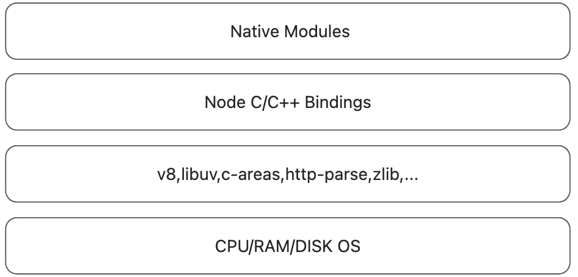
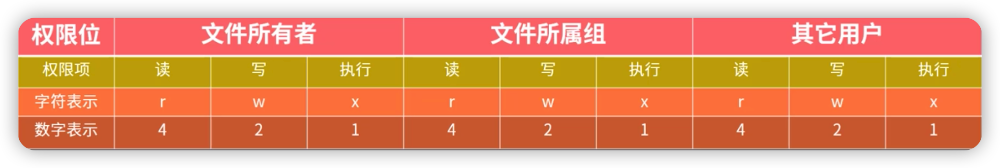

# node



node 为 js 能调用底层能力，使用 C/C++ Bindings 作为适配器。

适配器的上层是开发者可以使用 js 语法编写读写文件，网络请求等。

适配器的底层是 fs、http-parse 等 c++模块。

## 特点

1. 异步 IO，无需等待结果，可以继续执行后续逻辑。因此适合处理高并发的场景。
2. 事件循环机制，保证异步任务可以有序执行。
3. 事件驱动，可以为异步任务注册回调函数。
4. 单线程。

## 适用场景

适合 I/O 密集型 ， 不适合 CPU 密集型。

1. 前端基建
2. API 中间层
3. 聊天、考试程序

## 包管理工具

node 的包管理工具是 [npm](https://www.npmjs.com/) 。 

它允许 node 开发者，发布和使用三方包。

## 模块化

采用 Commonjs 规范。每一个文件即一个模块。

使用 `require` 关键字加载模块。

`require` 加载非路径模块（node_modules 模块）首先会在当前目录下的`node_modules`下查找，未找到，就会向上层目录的`node_modules`下查找，直至到盘符根目录。

如果加载了 `js` 文件模块，会将文件包装成类似下面的样子。

```javascript
const vm = require("vm");

const module =
  vm.runInThisContext(`(function module(exports, require, module, __filename, __dirname) {
  ...
  文件内容
  ...
})`);

module.call(exports, exports, require, module, __filename, __dirname);
```

## 事件循环

异步任务分类

- timers：执行 setTimeout 和 setInterval
- poll：执行与 I/O 相关回调
- check：执行 setImmediate 中的回调
- pending callbacks： 执行系统回调 例如 tcp udp
- idle，prepare： 系统内部调用
- close callbacks：执行 close 事件回调

细节

- 每一次事件循环，优先执行微任务队列。
- nextTick 优先级高于 Promise
- 切换异步任务队列的顺序 timers => poll => check
- setTimeout 为 0 时，有可能优于 setImmediate 执行

```javascript
console.log("start");

setTimeout(() => {
  console.log("out1");

  Promise.resolve().then(() => {
    console.log("p1");
  });

  Promise.resolve().then(() => {
    console.log("p2");
  });
});

Promise.resolve().then(() => {
  console.log("p5");
});

setTimeout(() => {
  console.log("out2");

  Promise.resolve().then(() => {
    console.log("p3");
  });

  Promise.resolve().then(() => {
    console.log("p4");
  });
});

console.log("end");
```

执行结果 `start -> end -> p5 -> out1 -> p1 -> p2 -> out2 -> p3 -> p4`

## 全局对象

- \_\_dirname
- \_\_filename
- process
- require/modules/exports
- setTimeout/setInterval/setImmediate
-

## Buffer

Buffer 不会占用 V8 堆内存空间

## Fs

文件的基本知识

- 权限位、标识符，读 r 写 w 执行 x
  

## EventEmitter

事件发射器。

保证了异步 IO 的回调可以正常执行。

```javascript
class Events {
  _events = Object.create(null);

  on(eventName, callback) {
    this._events[eventName] = [...(this._events[eventName] || []), callback];
  }

  emit(eventName) {
    this._events[eventName].forEach((item) => item());
  }
}
```

## stream

- 处理效率更高，同时处理多段 chunk
- 节省空间，避免整个 chunk 被加载进内存
- 操作方便