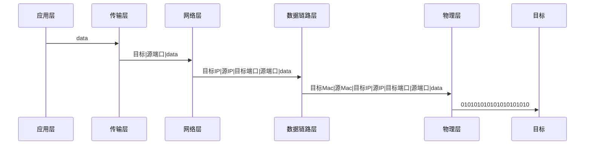
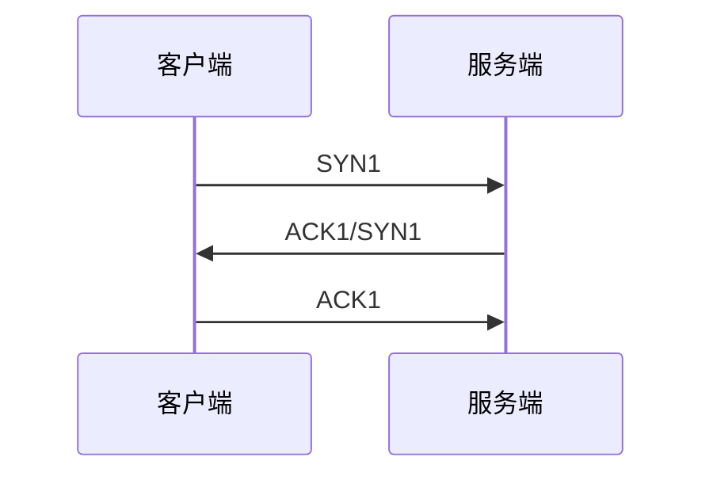

# 网络

## 主机通讯方式

- 交换机通讯 (通过 mac 地址区分不同的主机)
- 路由器通讯（通过 ip 连接不同的设备）

## 网络层次模型

OSI 七层模型

- 应用层 http、ssh
- 表示层 对数据进行加密、转换、压缩
- 会话层 控制网络的建立和终止
- 传输层 控制数据传输可靠性
- 网络层 ip 寻址
- 数据链路层 确定目标主机
- 物理层 解决使用回合中信号来传输比特的问题

## 数据传输

两个主机数据传输过程： `发起方 -> 应用层 -> 物理层 -> 接收方 -> 物理层 -> 应用层`



## 三次握手

- SYN = 1 建立连接信号
- FIN = 1 断开连接信号
- ACK = 1 数据信息确认



## 数据传输

客户端

```javascript
const net = require("net");
const Transform = require("./transform");

const transform = new Transform();
let receiveChunk = Buffer.from("");

const server = net.createConnection({
  port: 3000,
  host: "localhost",
});

server.on("connect", () => {
  // 发送数据
  server.write(transform.encode("数据1"));
  server.write(transform.encode("数据12"));
  server.write(transform.encode("数据123"));
  server.write(transform.encode("数据1234"));
  server.write(transform.encode("数据12345"));
});

server.on("data", (buffer) => {
  // 接收数据
  receiveChunk = Buffer.concat([receiveChunk, buffer]);

  while (transform.hasData(receiveChunk)) {
    // 获取一组数据
    const data = transform.getData(receiveChunk);

    console.log(data.currentBuffer.toString());

    receiveChunk = data.remainingBuffer;
  }
});
```

服务端

```javascript
const net = require("net");
const Transform = require("./transform");

const server = net.createServer();
const transform = new Transform();

let receiveChunk = Buffer.from("");

server.listen(3000, "localhost");

server.on("listening", () => {
  console.log("server is read");
});

server.on("connection", (socket) => {
  socket.on("data", (buffer) => {
    receiveChunk = Buffer.concat([receiveChunk, buffer]);

    while (transform.hasData(receiveChunk)) {
      const data = transform.getData(receiveChunk);

      console.log("请求数据" + data.currentBuffer.toString());
      socket.write(
        transform.encode("响应数据：" + data.currentBuffer.toString())
      );

      receiveChunk = data.remainingBuffer;
    }
  });
});
```

Transform

用于将每次的发送的数据进行打包，区分每一次数据传递。

```javascript
class Transform {
  constructor() {
    this.headerLen = 4;
  }

  encode(data) {
    const body = Buffer.from(data);
    const headerBuf = Buffer.alloc(this.headerLen);

    headerBuf.writeInt16BE(body.length);

    return Buffer.concat([headerBuf, body]);
  }

  getData(buffer) {
    const bufferLen = this.headerLen + buffer.readInt16BE();
    return {
      currentBuffer: buffer.slice(0, bufferLen).slice(this.headerLen),
      remainingBuffer: buffer.slice(bufferLen),
    };
  }

  hasData(buffer) {
    return buffer.length > this.headerLen;
  }
}

module.exports = Transform;
```
